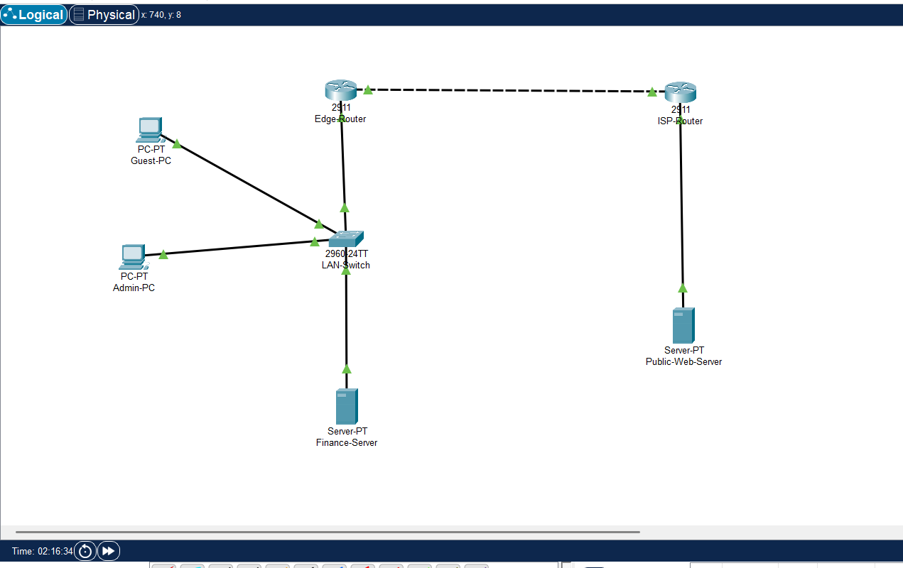
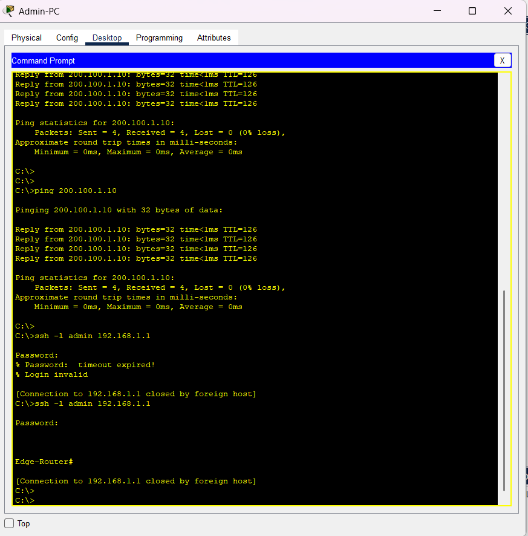
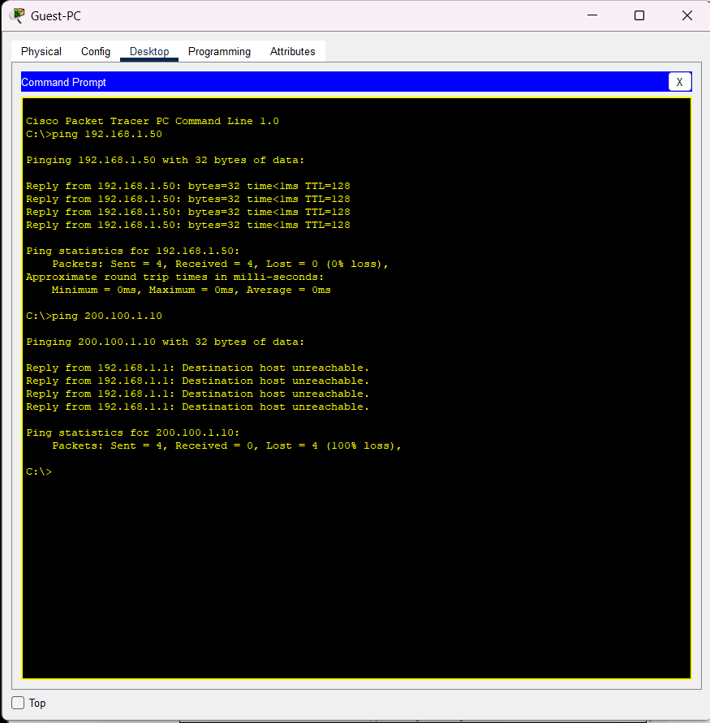

# Enterprise Perimeter Defense & Access Control Simulation

An enterprise-grade network security lab built on Cisco Packet Tracer, demonstrating boundary perimeter protection, NAT/PAT translation, Extended ACL filtering, Layer 2 switch security, and encrypted device management via SSHv2.

---

## 🏗️ Topology & Addressing

| Device | Interface | IP Address | Subnet Mask | Role |
| :--- | :--- | :--- | :--- | :--- |
| **Admin-PC** | Fa0 | `192.168.1.10` | `255.255.255.0` | Authorized Internal Host |
| **Guest-PC** | Fa0 | `192.168.1.20` | `255.255.255.0` | Restricted Internal Host |
| **Finance-Server** | Fa0 | `192.168.1.50` | `255.255.255.0` | Internal Asset |
| **Edge-Router** | G0/0 | `192.168.1.1` | `255.255.255.0` | LAN Gateway (Inside NAT) |
| **Edge-Router** | G0/1 | `203.0.113.2` | `255.255.255.252` | WAN Boundary (Outside NAT) |
| **ISP-Router** | G0/0 | `203.0.113.1` | `255.255.255.252` | ISP Gateway |
| **ISP-Router** | G0/1 | `200.100.1.1` | `255.255.255.0` | Public Web Gateway |
| **Public-Web-Server**| Fa0 | `200.100.1.10` | `255.255.255.0` | External Target |

---

## 🔒 Security Implementations

### 1. Dynamic NAT / PAT (Edge-Router)
```cisco
access-list 1 permit 192.168.1.0 0.0.0.255
ip nat inside source list 1 interface GigabitEthernet0/1 overload
interface GigabitEthernet0/0
 ip nat inside
interface GigabitEthernet0/1
 ip nat outside
ip route 0.0.0.0 0.0.0.0 203.0.113.1

2. Extended ACL Filtering (Edge-Router)
Restricts Guest-PC from accessing the public server while permitting other traffic:

Cisco CLI
ip access-list extended BLOCK-GUEST-WEB
 deny ip host 192.168.1.20 host 200.100.1.10
 permit ip any any
interface GigabitEthernet0/0
 ip access-group BLOCK-GUEST-WEB in

3. Layer 2 Switch Port Security (LAN-Switch)
Cisco CLI
interface FastEthernet0/1
 switchport mode access
 switchport port-security
 switchport port-security maximum 1
 switchport port-security mac-address sticky
 switchport port-security violation shutdown

4. Cryptographic Remote Access - SSHv2 (Edge-Router)
````cisco```
ip domain-name enterprise.local
crypto key generate rsa modulus 1024
username admin privilege 15 secret AdminPass123
ip ssh version 2
line vty 0 4
 transport input ssh
 login local
```
## 🧪 Verification & Evidence
| Feature | Execution Command | Result | Status |
| :--- | :--- | :--- | :--- |
| **PAT / NAT** | `Admin-PC` -> `ping 200.100.1.10` | Reply received (0% loss) | Passed |
| **Extended ACL** | `Guest-PC` -> `ping 200.100.1.10` | Destination host unreachable | Passed |
| **SSHv2 Session** | `Admin-PC` -> `ssh -l admin 192.168.1.1` | Successfully opened `Edge-Router#` | Passed |

### 📸 Lab Evidence

#### Network Topology


#### Administrative Access & NAT/PAT Verification


#### Extended ACL Drop Verification



